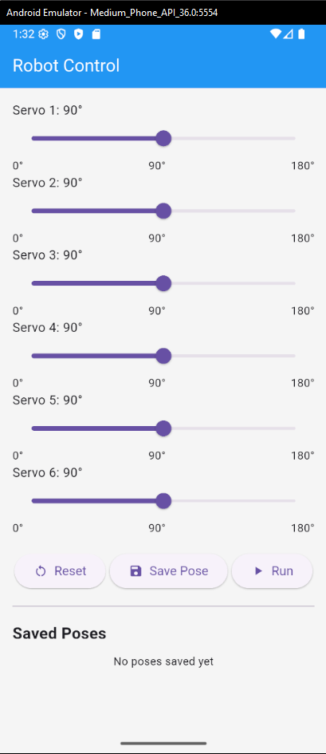
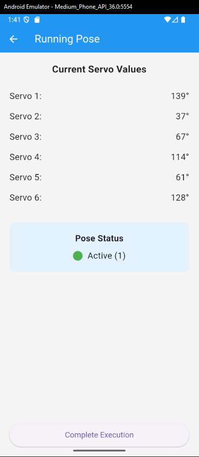

# Flutter Robot Servo Control App

A mobile application built with **Flutter** to control 6 servo motors via sliders (0° to 180°).  
The app communicates with a **PHP + MySQL** backend (running on XAMPP) over HTTP, sending updated servo angles in real time.

## Features

- **6 individual sliders** to control servo angles (0°–180°)
- **Live updates** sent to the backend
- **MySQL database integration** for storing servo positions
- **PHP API** as a bridge between the Flutter app and the database
- Works on **Android** and **iOS** devices

## Tech Stack

- **Frontend:** Flutter (Dart)
- **Backend:** PHP (with XAMPP)
- **Database:** MySQL
- **Protocol:** HTTP (REST API)

## Screenshots




## How It Works

1. The Flutter app has 6 sliders for the 6 servos.
2. When a slider is moved, it sends a POST request to the PHP backend.
3. The PHP backend updates the MySQL database with the new servo angle.
4. A microcontroller (e.g., Arduino) reads the database values and adjusts the servos accordingly.

## Installation & Setup

### 1. Backend Setup (PHP + MySQL)
1. Install [XAMPP](https://www.apachefriends.org/).
2. Create a MySQL database named `robot_control`.
3. Create a table:

```sql
CREATE TABLE servos (
    id INT AUTO_INCREMENT PRIMARY KEY,
    servo_number INT NOT NULL,
    angle INT NOT NULL
);
```

4. Add your PHP API files (`update_servo.php`, `get_servos.php`) to `htdocs` in your XAMPP folder.
5. Start Apache and MySQL in XAMPP.

---

### 2. Flutter Setup
1. [Install Flutter](https://docs.flutter.dev/get-started/install) and set up your environment.
2. Clone this repository:
```bash
git clone https://github.com/yourusername/flutter-servo-control.git
```
3. Navigate into the project folder:
```bash
cd flutter-servo-control
```
4. Install dependencies:
```bash
flutter pub get
```
5. Update the backend API URL in the Flutter code to match your PHP server's address (e.g., `http://192.168.x.x/update_servo.php`).
6. Run the app:
```bash
flutter run
```
